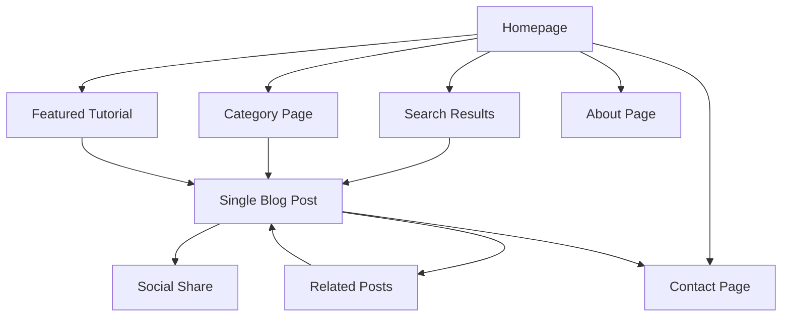

# Aram Tutorials - Product Requirements Document

## 1. Product Overview

Aram Tutorials is a modern, clean, and fast tech tutorial platform that delivers short, practical, beginner-friendly how-to videos and blog posts on everyday technology topics.

* The platform helps everyday people make sense of technology through clear, actionable guides covering app installations, productivity tools, Android configurations, and computer/mobile problem-solving.

* Target market: Tech beginners and intermediate users seeking quick, reliable solutions to common technology challenges.

## 2. Core Features

### 2.1 User Roles

| Role       | Registration Method      | Core Permissions                                                  |
| ---------- | ------------------------ | ----------------------------------------------------------------- |
| Visitor    | No registration required | Can browse all content, search tutorials, subscribe to newsletter |
| Subscriber | Email subscription       | Receives newsletter updates and tutorial notifications            |

### 2.2 Feature Module

Our Aram Tutorials website consists of the following main pages:

1. **Homepage**: Hero section with brand tagline, intro paragraph, featured tutorial, search bar, recent posts grid, categories section, newsletter opt-in.
2. **About Page**: Creator bio (Abdur-Rahman Abu Musa Bilal), mission statement, YouTube channel link.
3. **Blog/Tutorials Page**: Paginated tutorial grid, category/tag filters, post previews with thumbnails and reading time.
4. **Single Blog Post Page**: Full tutorial content, table of contents, related posts, social sharing, optional comments.
5. **Contact Page**: Contact form, email display, optional Google Form for tutorial requests.
6. **Privacy Policy Page**: Legal compliance content and data handling policies.
7. **Terms of Service Page**: Website usage terms and conditions.

### 2.3 Page Details

| Page Name           | Module Name         | Feature description                                                                                         |
| ------------------- | ------------------- | ----------------------------------------------------------------------------------------------------------- |
| Homepage            | Hero Section        | Display brand tagline "Tech Made Simple – One Tutorial at a Time", compelling visual, call-to-action button |
| Homepage            | Intro Paragraph     | Brief description of Abdur-Rahman and platform offerings                                                    |
| Homepage            | Featured Tutorial   | Highlight latest or most popular tutorial with video/image preview                                          |
| Homepage            | Search Bar          | Real-time search functionality for finding specific tutorials                                               |
| Homepage            | Recent Posts Grid   | Display 6-8 latest tutorials with thumbnails, titles, excerpts                                              |
| Homepage            | Categories Section  | Visual category tiles for Mac, Windows, Android, VS Code, Homebrew, Google Tools                            |
| Homepage            | Newsletter Opt-in   | Email subscription form with compelling copy                                                                |
| About Page          | Creator Bio         | Personal introduction of Abdur-Rahman Abu Musa Bilal with photo                                             |
| About Page          | Mission Statement   | Clear explanation of platform purpose and value proposition                                                 |
| About Page          | YouTube Integration | Link to YouTube channel with subscriber count display                                                       |
| Blog/Tutorials Page | Tutorial Grid       | Paginated display of all tutorials with infinite scroll or pagination                                       |
| Blog/Tutorials Page | Filter System       | Category and tag-based filtering with search functionality                                                  |
| Blog/Tutorials Page | Post Preview Cards  | Title, excerpt, thumbnail, reading time, publication date, category tags                                    |
| Single Blog Post    | Article Header      | Title, featured image/video, author info, publication date, reading time                                    |
| Single Blog Post    | Content Area        | Rich text content with code snippets, screenshots, headings, callouts                                       |
| Single Blog Post    | Table of Contents   | Auto-generated TOC for posts with multiple sections                                                         |
| Single Blog Post    | Related Posts       | Algorithm-based suggestions for similar tutorials                                                           |
| Single Blog Post    | Social Sharing      | Share buttons for Twitter, LinkedIn, Facebook, copy link                                                    |
| Single Blog Post    | Comments Section    | Optional Disqus or native commenting system                                                                 |
| Contact Page        | Contact Form        | Name, email, message fields with validation and spam protection                                             |
| Contact Page        | Direct Contact      | Display <aramtutorials@gmail.com> with mailto link                                                          |
| Contact Page        | Tutorial Requests   | Embedded Google Form for content suggestions                                                                |
| Privacy Policy      | Legal Content       | GDPR-compliant privacy policy with data handling procedures                                                 |
| Terms of Service    | Legal Content       | Website usage terms, content licensing, user responsibilities                                               |

## 3. Core Process

**Visitor Flow:**
Users land on the homepage, browse featured content, use search or categories to find specific tutorials, read full articles, and optionally subscribe to the newsletter or contact for requests.

**Content Discovery Flow:**
Users can discover content through homepage features, category browsing, search functionality, or related post recommendations within individual articles.

## 4. User Interface Design

### 4.1 Design Style

* **Primary Colors**: Deep blue (#1e293b) for headers and accents, white (#ffffff) for backgrounds

* **Secondary Colors**: Accent yellow (#fbbf24) or green (#10b981) for call-to-action buttons and highlights

* **Typography**: Clean sans-serif fonts (Inter or Roboto) with 16px base size, 24px for headings

* **Button Style**: Rounded corners (8px radius), soft shadows, hover animations

* **Layout Style**: Card-based design with generous white space, top navigation with mobile hamburger menu

* **Visual Elements**: Soft drop shadows, subtle gradients, tech-themed icons, emoji integration for categories

### 4.2 Page Design Overview

| Page Name | Module Name  | UI Elements                                                                                                              |
| --------- | ------------ | ------------------------------------------------------------------------------------------------------------------------ |
| Homepage  | Hero Section | Full-width background with overlay text, gradient from deep blue to lighter blue, centered content with large typography |
| Homepage  | Navigation   | Sticky header with logo, menu items, search icon, dark mode toggle, mobile hamburger menu                                |
| Homepage  | Recent Posts | 3-column grid on desktop, 1-column on mobile, card design                                                                |

