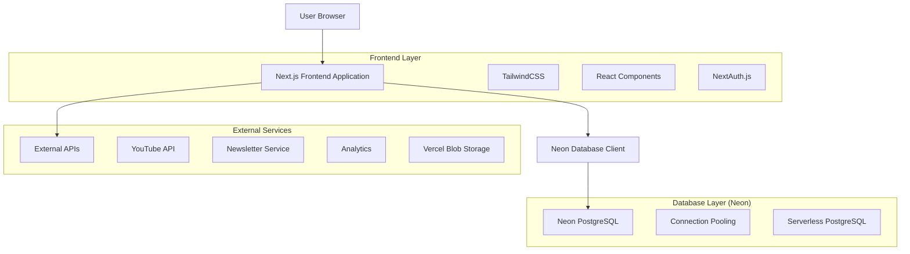
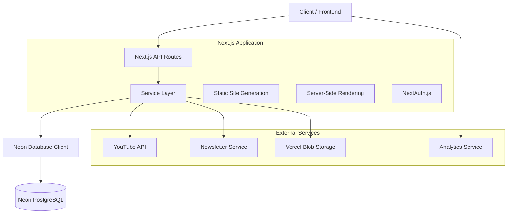
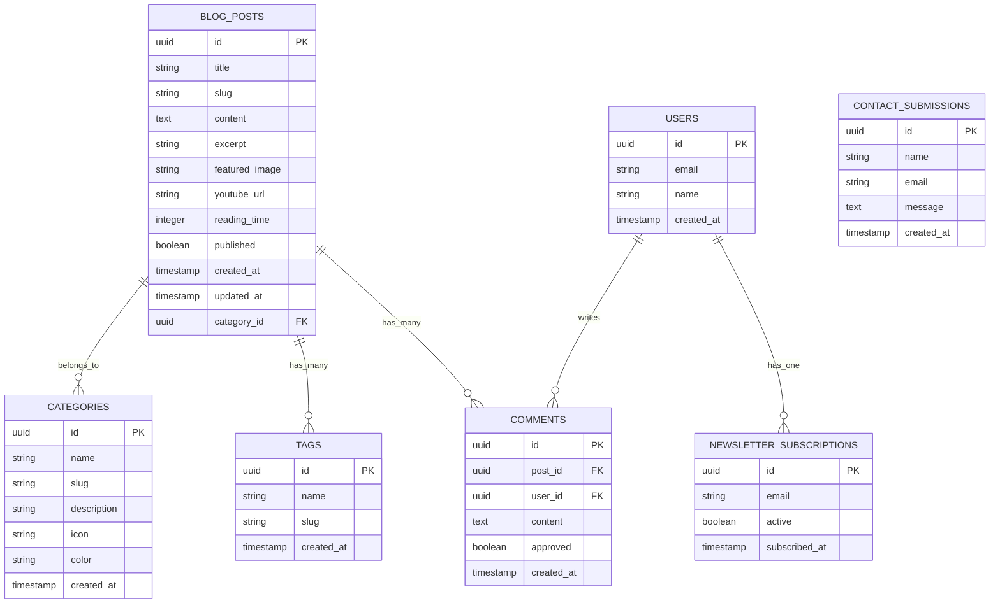

# Aram Tutorials - Technical Architecture Document

## 1. Architecture Design



## 2. Technology Description

- **Frontend**: Next.js\@14 + React\@18 + TailwindCSS\@3 + TypeScript

\*- **Database**: Neon PostgreSQL with connection pooling

- **Authentication**: NextAuth.js

- **File Storage**: Vercel Blob Storage

* **Styling**: TailwindCSS with custom design system

* **Deployment**: Vercel

* **Analytics**: Plausible Analytics

* **Content Management**: Markdown-based with frontmatter

## 3. Route Definitions

| Route           | Purpose                                                      |
| --------------- | ------------------------------------------------------------ |
| /               | Homepage with hero section, featured content, and navigation |
| /about          | About page with creator bio and mission statement            |
| /blog           | Blog listing page with pagination and filtering              |
| /blog/\[slug]   | Individual blog post pages with full content                 |
| /contact        | Contact page with form and direct contact information        |
| /privacy        | Privacy policy page for legal compliance                     |
| /terms          | Terms of service page                                        |
| /api/contact    | API endpoint for contact form submissions                    |
| /api/newsletter | API endpoint for newsletter subscriptions                    |
| /api/search     | API endpoint for blog post search functionality              |

## 4. API Definitions

### 4.1 Core API

**Contact Form Submission**

```
POST /api/contact
```

Request:

| Param Name | Param Type | isRequired | Description                    |
| ---------- | ---------- | ---------- | ------------------------------ |
| name       | string     | true       | Contact person's name          |
| email      | string     | true       | Contact person's email address |
| message    | string     | true       | Message content                |

Response:

| Param Name | Param Type | Description                           |
| ---------- | ---------- | ------------------------------------- |
| success    | boolean    | Whether the submission was successful |
| message    | string     | Response message                      |

Example:

```json
{
  "name": "John Doe",
  "email": "john@example.com",
  "message": "Great tutorials! Can you create one about Docker?"
}
```

**Newsletter Subscription**

```
POST /api/newsletter
```

Request:

| Param Name | Param Type | isRequired | Description                |
| ---------- | ---------- | ---------- | -------------------------- |
| email      | string     | true       | Subscriber's email address |

Response:

| Param Name | Param Type | Description                             |
| ---------- | ---------- | --------------------------------------- |
| success    | boolean    | Whether the subscription was successful |
| message    | string     | Response message                        |

**Blog Search**

```
GET /api/search?q={query}&category={category}
```

Request:

| Param Name | Param Type | isRequired | Description         |
| ---------- | ---------- | ---------- | ------------------- |
| q          | string     | false      | Search query string |
| category   | string     | false      | Filter by category  |

Response:

| Param Name | Param Type | Description                  |
| ---------- | ---------- | ---------------------------- |
| posts      | array      | Array of matching blog posts |
| total      | number     | Total number of results      |

## 5. Server Architecture Diagram



## 6. Data Model

### 6.1 Data Model Definition



### 6.2 Data Definition Language

**Blog Posts Table**

```sql
-- Create blog_posts table
CREATE TABLE blog_posts (
    id UUID PRIMARY KEY DEFAULT gen_random_uuid(),
    title VARCHAR(255) NOT NULL,
    slug VARCHAR(255) UNIQUE NOT NULL,
    content TEXT NOT NULL,
    excerpt TEXT,
    featured_image VARCHAR(500),
    youtube_url VARCHAR(500),
    reading_time INTEGER DEFAULT 5,
    published BOOLEAN DEFAULT false,
    category_id UUID REFERENCES categories(id),
    created_at TIMESTAMP WITH TIME ZONE DEFAULT NOW(),
    updated_at TIMESTAMP WITH TIME ZONE DEFAULT NOW()
);

-- Create categories table
CREATE TABLE categories (
    id UUID PRIMARY KEY DEFAULT gen_random_uuid(),
    name VARCHAR(100) NOT NULL,
    slug VARCHAR(100) UNIQUE NOT NULL,
    description TEXT,
    icon VARCHAR(50),
    color VARCHAR(7) DEFAULT '#1e293b',
    created_at TIMESTAMP WITH TIME ZONE DEFAULT NOW()
);

-- Create tags table
CREATE TABLE tags (
    id UUID PRIMARY KEY DEFAULT gen_random_uuid(),
    name VARCHAR(50) NOT NULL,
    slug VARCHAR(50) UNIQUE NOT NULL,
    created_at TIMESTAMP WITH TIME ZONE DEFAULT NOW()
);

-- Create post_tags junction table
CREATE TABLE post_tags (
    post_id UUID REFERENCES blog_posts(id) ON DELETE CASCADE,
    tag_id UUID REFERENCES tags(id) ON DELETE CASCADE,
    PRIMARY KEY (post_id, tag_id)
);

-- Create newsletter_subscriptions table
CREATE TABLE newsletter_subscriptions (
    id UUID PRIMARY KEY DEFAULT gen_random_uuid(),
    email VARCHAR(255) UNIQUE NOT NULL,
    active BOOLEAN DEFAULT true,
    subscribed_at TIMESTAMP WITH TIME ZONE DEFAULT NOW()
);

-- Create contact_submissions table
CREATE TABLE contact_submissions (
    id UUID PRIMARY KEY DEFAULT gen_random_uuid(),
    name VARCHAR(100) NOT NULL,
    email VARCHAR(255) NOT NULL,
    message TEXT NOT NULL,
    created_at TIMESTAMP WITH TIME ZONE DEFAULT NOW()
);

-- Create indexes for performance
CREATE INDEX idx_blog_posts_published ON blog_posts(published, created_at DESC);
CREATE INDEX idx_blog_posts_category ON blog_posts(category_id);
CREATE INDEX idx_blog_posts_slug ON blog_posts(slug);
CREATE INDEX idx_categories_slug ON categories(slug);
CREATE INDEX idx_tags_slug ON tags(slug);

-- Grant permissions for Neon database
-- Note: Neon uses standard PostgreSQL permissions
-- Application-level authentication will be handled by NextAuth.js
GRANT SELECT ON blog_posts TO PUBLIC;
GRANT SELECT ON categories TO PUBLIC;
GRANT SELECT ON tags TO PUBLIC;
GRANT SELECT ON post_tags TO PUBLIC;
-- Admin operations will be handled through authenticated API routes

-- Insert initial categories
INSERT INTO categories (name, slug, description, icon, color) VALUES
('Mac', 'mac', 'Tutorials for macOS users', '🍎', '#007AFF'),
('Windows', 'windows', 'Windows tips and guides', '🪟', '#0078D4'),
('Android', 'android', 'Android app configurations', '🤖', '#3DDC84'),
('VS Code', 'vs-code', 'Visual Studio Code tutorials', '💻', '#007ACC'),
('Homebrew', 'homebrew', 'Package management for macOS', '🍺', '#FBB040'),
('Google Tools', 'google-tools', 'Google productivity tools', '🔍', '#4285F4');

-- Insert sample tags
INSERT INTO tags (name, slug) VALUES
('beginner', 'beginner'),
('installation', 'installation'),
('configuration', 'configuration'),
('productivity', 'productivity'),
('troubleshooting', 'troubleshooting'),
('tips', 'tips');
```
