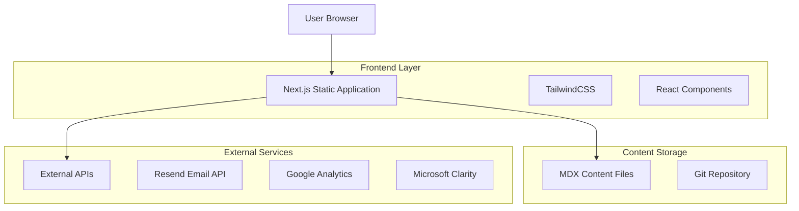
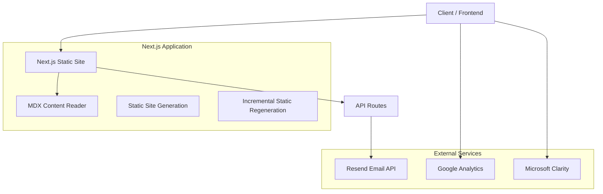

# Aram Tutorials - Technical Architecture Document

## 1. Architecture Design



## 2. Technology Description

- **Frontend**: Next.js 15 + React 19 + TailwindCSS 4 + TypeScript
- **Content Management**: Markdown-based MDX files with frontmatter
- **Styling**: TailwindCSS with custom design system
- **Email Service**: Resend for contact form and newsletter
- **Analytics**: Google Analytics 4 + Microsoft Clarity (consent-based)
- **Deployment**: Vercel
- **Authentication**: None (fully static application)
- **Database**: None (content managed via Git)

## 3. Route Definitions

| Route           | Purpose                                                      |
| --------------- | ------------------------------------------------------------ |
| /               | Homepage with hero section, featured content, and navigation |
| /about          | About page with creator bio and mission statement            |
| /blog           | Blog listing page with pagination and filtering              |
| /blog/\[slug]   | Individual blog post pages with full content                 |
| /contact        | Contact page with form and direct contact information        |
| /privacy        | Privacy policy page for legal compliance                     |
| /terms          | Terms of service page                                        |
| /api/contact    | API endpoint for contact form submissions                    |
| /api/newsletter | API endpoint for newsletter subscriptions                    |
| /api/search     | API endpoint for blog post search functionality              |

## 4. API Definitions

### 4.1 Core API

**Contact Form Submission**

```
POST /api/contact
```

Request:

| Param Name | Param Type | isRequired | Description                    |
| ---------- | ---------- | ---------- | ------------------------------ |
| name       | string     | true       | Contact person's name          |
| email      | string     | true       | Contact person's email address |
| message    | string     | true       | Message content                |

Response:

| Param Name | Param Type | Description                           |
| ---------- | ---------- | ------------------------------------- |
| success    | boolean    | Whether the submission was successful |
| message    | string     | Response message                      |

Example:

```json
{
  "name": "John Doe",
  "email": "john@example.com",
  "message": "Great tutorials! Can you create one about Docker?"
}
```

**Newsletter Subscription**

```
POST /api/newsletter
```

Request:

| Param Name | Param Type | isRequired | Description                |
| ---------- | ---------- | ---------- | -------------------------- |
| email      | string     | true       | Subscriber's email address |

Response:

| Param Name | Param Type | Description                             |
| ---------- | ---------- | --------------------------------------- |
| success    | boolean    | Whether the subscription was successful |
| message    | string     | Response message                        |

**Blog Search**

```
GET /api/search?q={query}&category={category}
```

Request:

| Param Name | Param Type | isRequired | Description         |
| ---------- | ---------- | ---------- | ------------------- |
| q          | string     | false      | Search query string |
| category   | string     | false      | Filter by category  |

Response:

| Param Name | Param Type | Description                  |
| ---------- | ---------- | ---------------------------- |
| posts      | array      | Array of matching blog posts |
| total      | number     | Total number of results      |

## 5. Server Architecture Diagram



## 6. Content Model

### 6.1 MDX File Structure

Tutorial content is stored in MDX files located in `src/content/tutorials/`. Each file represents a tutorial post with frontmatter metadata.

**Frontmatter Schema:**

```typescript
interface MDXFrontmatter {
  title: string;              // Tutorial title
  description: string;         // SEO description
  publishedAt: string;         // Publication date (YYYY-MM-DD)
  author: string;              // Author name (default: "Aram Tutorials")
  category: string;            // Category slug (mac, windows, etc.)
  tags: string[];            // Array of tag strings
  featured?: boolean;         // Whether to feature on homepage
  readingTime?: number;       // Estimated reading time in minutes
}
```

**Content Structure:**

- MDX files use standard Markdown with React components
- Custom components available: `<Prerequisites>`, `<StepList>`, `<Step>`, `<Card>`, etc.
- Code blocks are highlighted with `rehype-highlight`
- Syntax: markdown + JSX

### 6.2 API Data Handling

**Contact Form API (`/api/contact`):**
- Receives: name, email, message
- Action: Sends email via Resend to `aramtutorials@gmail.com`
- Storage: No database storage

**Newsletter API (`/api/newsletter`):**
- Receives: email
- Action: Adds to Resend contacts list or sends notification email
- Storage: Resend Audience

**Search API (`/api/search`):**
- Client-side search of MDX content
- No backend database required
